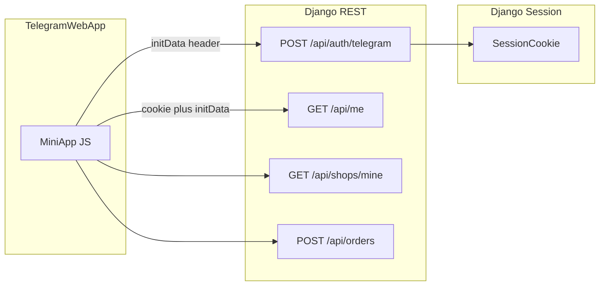

# Texnik topshiriq (TZ): miniapp_marketplace — joriy funksional (1:1)

## 1. Maqsad va doira

- **Maqsad**: Telegram Mini App ichida do‘kon vitrinasi, mahsulot PDP, buyurtma formasi, sotuvchi kabineti (mahsulotlar, buyurtmalar, obuna), mijoz buyurtmalar ro‘yxati; tashqi **marketing landing**; **platform boshqaruvi** (`/platform/`) — foydalanuvchilar, do‘konlar, obuna to‘lovlari, buyurtmalar, broadcast, audit, leadlar, CSV eksport.
- **Tashqi integratsiya**: Telegram `initData` autentifikatsiyasi (header), Telegram Bot **webhook** (`/api/bot/webhook/<secret>/`), Telegram **sendMessage** (buyurtma va holat xabarlari, landing lead bildirishnomasi).
- **Tashqi to‘lov**: Click va h.k. **hozircha kodda yo‘q** ([`config/settings.py`](config/settings.py) da izoh); obuna — **skrinshot + platform tasdiqi**.

## 2. Texnologik stack

- **Backend**: Python 3, **Django 5.x**, **Django REST Framework 3.15+** ([`requirements.txt`](requirements.txt)).
- **DB**: **PostgreSQL** (default); ixtiyoriy **SQLite** `USE_SQLITE=1` ([`config/settings.py`](config/settings.py)).
- **Rasm**: Pillow; server: **Gunicorn**; env: **python-dotenv**; HTTP: **requests**.
- **Frontend (webapp)**: Django templates + Tailwind CDN + [`static/css/app.css`](static/css/app.css) + [`static/js/app.js`](static/js/app.js) (`MiniApp` obyekti: `apiFetch`, `waitForInitData`, toast, haptic).
- **i18n**: `LANGUAGE_CODE=uz`, qo‘shimcha `ru`, `LOCALE_PATHS` ([`config/settings.py`](config/settings.py)).

## 3. Loyiha tuzilishi (paketlar)

Django `INSTALLED_APPS`: `apps.core`, `apps.users`, `apps.shops`, `apps.products`, `apps.orders`, `apps.platform` ([`config/settings.py`](config/settings.py)).

Asosiy URL ildiz: [`config/urls.py`](config/urls.py).

| Modul | Vazifa |
|--------|--------|
| [`apps/core`](apps/core) | Webapp sahifalari, landing, lead API, initData tekshiruvi, slug/rasm utilitlari, pagination |
| [`apps/users`](apps/users) | `User` modeli, Telegram auth, `/me`, sotuvchi bo‘lish, shartlar, webhook |
| [`apps/shops`](apps/shops) | Do‘kon, tarif, obuna to‘lovi, discover, monetizatsiya |
| [`apps/products`](apps/products) | Mahsulot CRUD (seller), public list/detail |
| [`apps/orders`](apps/orders) | Buyurtma yaratish, holatlar, izohlar, CSV, idempotency |
| [`apps/platform`](apps/platform) | Operator UI + stats API, audit, analytics event |

## 4. Muhit o‘zgaruvchilari (to‘liq ro‘yxat — `config/settings.py`)

- **Django**: `DJANGO_SECRET_KEY`, `DJANGO_DEBUG`, `DJANGO_ALLOWED_HOSTS`, `DJANGO_CSRF_TRUSTED_ORIGINS`, `SESSION_COOKIE_SECURE` (`0/1` yoki bo‘sh → `not DEBUG`), `SESSION_COOKIE_SAMESITE`.
- **Statik**: `STATIC_ASSET_VERSION`.
- **DB**: `POSTGRES_*` yoki `USE_SQLITE`.
- **Telegram**: `TELEGRAM_BOT_TOKEN`, `TELEGRAM_BOT_USERNAME`, `TELEGRAM_WEBHOOK_SECRET`, `TELEGRAM_INITDATA_MAX_AGE_SECONDS`.
- **URL**: `PUBLIC_BASE_URL`, `PLATFORM_SUPPORT_EMAIL`, `PLATFORM_SUBSCRIPTION_PAYMENT_NOTE`.
- **Landing**: `LANDING_NOTIFY_TELEGRAM_IDS`.
- **Bot onboarding**: `BOT_ONBOARDING_MAX_PER_DAY`, `BOT_ONBOARDING_DELAYS`, `BOT_START_BUTTON_MINI_TEXT`, `BOT_START_BUTTON_SELLER_TEXT`, `BOT_START_KEYBOARD_STYLE` (`reply` default).
- **Huquqiy**: `CURRENT_SELLER_TERMS_VERSION`.
- **Monetizatsiya**: `MONETIZATION_FREE_MAX_PRODUCTS`, `MONETIZATION_UPSELL_MIN_VIEWS_WEEK`.
- **API**: `API_ORDER_CREATE_THROTTLE` (default `60/hour`).

## 5. Ma’lumotlar modeli (1:1 maydonlar)

### 5.1 [`apps/users/models.py`](apps/users/models.py) — `User`

- `telegram_id` (BigInt, unique, index) — **USERNAME_FIELD**.
- `first_name`, `last_name`, `username` (string, bo‘sh mumkin).
- `role`: `buyer` \| `seller` \| `admin` \| `platform_owner` (default `buyer`).
- `is_staff`, `is_active`, `created_at`.
- `seller_terms_version`, `seller_terms_accepted_at` (sotuvchi ofertasi versiyasi).
- `UserManager`: `create_user(telegram_id)`, `create_superuser` → `role=admin`, staff/superuser.

**Qo‘shimcha**: `TelegramWebhookDedup(update_id)`, `BotOnboardingQuota(chat_id, day, count)` — webhook takrori va kunlik nudge limiti.

### 5.2 [`apps/shops/models.py`](apps/shops/models.py)

**`SubscriptionPlan`**: `name`, `duration_months`, `price`, `currency` (default UZS), `is_active`, `sort_order`, `max_products` (null = cheksiz), `includes_advanced_analytics`.

**`Shop`**:
- `owner` FK → User (unique constraint: **bir foydalanuvchida bitta do‘kon** `shops_shop_owner_uniq`).
- `name`, `slug` (unique, auto `unique_shop_slug` save da), `description`, `phone`, `phone_secondary`, `address`, `social_telegram`, `social_instagram`, `social_facebook`, `payment_note` (max 800).
- `logo` ImageField `shop_logos/` (save da PIL bilan optimallashtirish).
- `subscription_status`: `trial` \| `active` \| `expired` \| `payment_pending` \| `suspended`.
- `trial_started_at`, `trial_ends_at`, `current_plan` FK, `subscription_ends_at` (active uchun null = cheksiz legacy).
- `is_active`, `is_verified`, `first_order_completed_at`, `created_at`.
- Metod: `is_subscription_operational()` — trial/active muddati tekshiruvi.

**`SubscriptionPayment`**: `shop`, `plan`, `amount`, `status` (`pending`/`approved`/`rejected`), `proof_image`, `notes`, `admin_note`, `created_at`, `reviewed_at`, `reviewed_by`. **Unique**: bitta `pending` to‘lov do‘kon bo‘yicha (`uniq_subscriptionpayment_pending_per_shop`).

### 5.3 [`apps/products/models.py`](apps/products/models.py) — `Product`

- `shop` FK, `name`, `slug` (shop ichida unique), `price`, **`image` majburiy**, `description`, `scarcity_text`, `social_proof_text`, `is_active`, `sort_order`, `created_at`.
- Save: slug avto; rasm optimallashtirish.

### 5.4 [`apps/orders/models.py`](apps/orders/models.py)

- **`Order`**: `product`, `shop`, `buyer` (null mumkin), `customer_name`, `phone`, `address`, `status` (`NEW`/`ACCEPTED`/`DELIVERED`/`CANCELLED`), `total_amount` (default 0), `created_at`.
- **`OrderIdempotency`**: `key` (unique), `order` OneToOne.
- **`OrderNote`**: `order`, `author`, `body`, `created_at`.

### 5.5 [`apps/core/models.py`](apps/core/models.py) — `Lead`

- `name`, `phone`, `comment`, `source` (`landing_modal` … `landing_final`), `user_agent`, `referrer`, `ip_address`, `created_at`.

### 5.6 [`apps/platform/models.py`](apps/platform/models.py)

- **`StaffAuditLog`**: `actor`, `action`, `target_type`, `target_id`, `payload` JSON, `created_at`.
- **`AnalyticsEvent`**: `event_type` (`shop_view`), `path`, `shop_id`, `created_at`.

## 6. Autentifikatsiya va sessiya

### 6.1 REST: Telegram `initData`

- **Klass**: [`apps/users/authentication.py`](apps/users/authentication.py) — `TelegramInitDataAuthentication`.
- **Header**: `X-Telegram-Init-Data` (yoki `HTTP_X_TELEGRAM_INIT_DATA`) — Telegram `initData` qatori.
- **Tekshiruv**: [`apps/core/initdata.py`](apps/core/initdata.py) `verify_init_data(raw, TELEGRAM_BOT_TOKEN)`; `TELEGRAM_INITDATA_MAX_AGE_SECONDS`.
- **User**: `upsert_user_from_telegram_user` — `telegram_id` bo‘yicha create/update.

### 6.2 Webapp sessiyasi

- **`POST /api/auth/telegram/`** ([`apps/users/views.py`](apps/users/views.py)): body `{ init_data }` — `login(request, user)`; session cookie.
- Keyingi `apiFetch` so‘rovlari: cookie + `X-Telegram-Init-Data` ( [`static/js/app.js`](static/js/app.js) da aniqroq implementatsiya).

### 6.3 Platform panel

- Oddiy **Django session** + `LoginView` ([`apps/platform/views.py`](apps/platform/views.py) `PlatformLoginForm`).
- **Kirish sharti**: [`apps/platform/utils.py`](apps/platform/utils.py) `is_platform_staff` — `superuser` yoki `role in (admin, platform_owner)`.

## 7. REST API katalogi (barcha marshrutlar)

Barcha API `config/urls.py` orqali **`/api/`** ostida ([`config/urls.py`](config/urls.py)).

### 7.1 Users — [`apps/users/urls.py`](apps/users/urls.py)

| Method | Path | Ruxsat | Vazifa |
|--------|------|--------|--------|
| POST | `/api/auth/telegram/` | AllowAny | initData tekshiruv, session |
| POST | `/api/bot/webhook/<secret>/` | Secret URL | Telegram update (dedup, onboarding) |
| GET | `/api/me/` | IsAuthenticated | `UserSerializer` |
| POST | `/api/me/become-seller/` | IsAuthenticated | `role=seller` (admin/platform_owner/superuser no-op); **sotuvchi shartlari** talab |
| POST | `/api/me/accept-seller-terms/` | IsAuthenticated | `record_seller_terms_acceptance` |

**`UserSerializer` maydonlari** ([`apps/users/serializers.py`](apps/users/serializers.py)): `id`, `telegram_id`, `first_name`, `last_name`, `username`, `role`, `created_at`, `seller_terms_ok`, `required_seller_terms_version`.

### 7.2 Shops — [`apps/shops/urls.py`](apps/shops/urls.py)

| Method | Path | Ruxsat / shartlar | Vazifa |
|--------|------|-------------------|--------|
| GET | `/api/seller/stats/` | IsAuthenticated + `IsSellerOrAdmin` | Do‘kon statistikasi (ko‘rishlar, buyurtmalar, upsell flag) |
| GET | `/api/subscription/plans/` | AllowAny | Faol tariflar + platform `payment_note` / `support_email` |
| GET | `/api/shops/discover/` | IsAuthenticated | Ochiq do‘konlar (faol mahsulot + operational subscription), pagination |
| POST | `/api/shops/` | IsAuthenticated + `IsSellerOrAdmin` | Do‘kon yaratish (`name`); terms; **bitta do‘kon**; `apply_trial_for_new_shop` |
| GET | `/api/shops/mine/` | IsAuthenticated + `IsSellerOrAdmin` | `ShopSerializer`; agar `role=buyer` lekin do‘kon bo‘lsa → **role seller ga yangilanadi** ([`apps/shops/views.py`](apps/shops/views.py)) |
| POST | `/api/shops/mine/payments/` | IsAuthenticated + `IsSellerOrAdmin` | Skrinshot obuna to‘lovi; `payment_pending` conflict 409 |
| PATCH | `/api/shops/<id>/` | IsAuthenticated + `IsSellerOrAdmin` + `IsShopOwnerOrAdmin` | Shop yangilash; oddiy sotuvchi `is_active` o‘zgartira olmaydi |
| GET | `/api/shops/<id>/public/` | AllowAny | Faol + operational bo‘lmasa 404 — `ShopPublicSerializer` |
| GET | `/api/shops/<id>/public/link/` | AllowAny | `url`, `startapp`, `telegram_deep_link` |
| GET | `/api/shops/<id>/link/` | IsAuthenticated | Egasi yoki admin/platform_owner — havola |

**`IsSellerOrAdmin`** ([`apps/shops/permissions.py`](apps/shops/permissions.py)): seller/admin/platform_owner/superuser **yoki** `Shop.objects.filter(owner_id=user.pk).exists()` (do‘kon egasi `buyer` qolgan edge case).

**`IsShopOwnerOrAdmin`**: superuser / admin / platform_owner yoki `obj.owner_id == user.id`.

### 7.3 Products — [`apps/products/urls.py`](apps/products/urls.py)

| Method | Path | Ruxsat | Vazifa |
|--------|------|--------|--------|
| GET | `/api/shops/<shop_id>/products/` | AllowAny (public ro‘yxat) | Filtrlash/pagination (kod: [`apps/products/views.py`](apps/products/views.py)) |
| GET | `/api/shops/<shop_id>/products/<product_id>/public/` | AllowAny | PDP ma’lumot |
| GET | `/api/shops/<shop_id>/products/<product_id>/public/link/` | AllowAny | Mahsulot deep link |
| GET | `/api/seller/products/` | IsAuthenticated + `IsSellerOrAdmin` | Sotuvchi mahsulotlari |
| POST/PATCH/DELETE | `/api/seller/products/<id>/` | IsAuthenticated + owner shop | CRUD (detail) |
| POST | `/api/seller/products/<id>/duplicate/` | IsAuthenticated + `IsSellerOrAdmin` | Nusxa |
| PATCH | `/api/admin/products/<id>/` | Admin/platform (kodda permission) | Moderatsiya blok |

### 7.4 Orders — [`apps/orders/urls.py`](apps/orders/urls.py)

| Method | Path | Ruxsat | Vazifa |
|--------|------|--------|--------|
| GET | `/api/orders/mine/` | IsAuthenticated | Mijoz buyurtmalari (pagination) |
| POST | `/api/orders/` | IsAuthenticated + **throttle** `OrderCreateThrottle` | Yaratish: body `OrderCreateSerializer` — `product`, `customer_name`, `phone`, `address`; `Idempotency-Key` / `X-Idempotency-Key` (128); buyer lock; bildirishnomalar thread |
| GET | `/api/orders/<id>/` | IsAuthenticated | Mijoz detal |
| POST | `/api/orders/<id>/cancel/` | IsAuthenticated | Mijoz bekor (holat mashinasi + notify) |
| GET/POST | `/api/orders/<id>/notes/` | IsAuthenticated | Izohlar ro‘yxati / yozish |
| GET | `/api/seller/orders/` | IsAuthenticated + `IsSellerOrAdmin` | Sotuvchi ro‘yxat + stats (serializer) |
| GET | `/api/seller/orders/export/` | IsAuthenticated + `IsSellerOrAdmin` | CSV |
| POST | `/api/seller/orders/<id>/accept/` | IsAuthenticated + seller shop | NEW → ACCEPTED |
| POST | `/api/seller/orders/<id>/deliver/` | IsAuthenticated | ACCEPTED → DELIVERED |
| POST | `/api/seller/orders/<id>/cancel/` | IsAuthenticated | NEW → CANCELLED (confirm UI) |
| PATCH | `/api/seller/orders/<id>/` | IsAuthenticated | Holat PATCH (`_seller_apply_status_change`) |

**Holat mashinasi** ([`apps/orders/state_machine.py`](apps/orders/state_machine.py)): `NEW → {ACCEPTED, CANCELLED}`; `ACCEPTED → {DELIVERED}`; boshqa o‘tishlar taqiqlanadi.

**Buyurtma yaratish validatsiyasi** ([`apps/orders/serializers.py`](apps/orders/serializers.py)): do‘kon `is_active` va `is_subscription_operational()`; telefon minimal raqamli tekshiruv.

### 7.5 Core — landing lead

- **`POST /api/landing/lead/`** ([`config/urls.py`](config/urls.py) → [`apps/core/views.py`](apps/core/views.py)): rate limit (cache), `Lead` yaratish, `notify_lead_admins` (Telegram ID lar env dan).

### 7.6 Platform API

- **`GET /api/platform/stats/`** ([`apps/platform/api_urls.py`](apps/platform/api_urls.py), [`apps/platform/api.py`](apps/platform/api.py)): SessionAuthentication + `is_platform_staff` — JSON statistikalar.

## 8. Web ilova (HTML) marshrutlari

Barcha **`/webapp/`** — [`apps/core/urls.py`](apps/core/urls.py) + view lar [`apps/core/views.py`](apps/core/views.py).

| Path | View | Mazmuni |
|------|------|---------|
| `/webapp/` | `webapp_home` | Router: initData, `/shops/mine/` (404=yo‘q, boshqa xato=manual yo‘nalish), `start_param` slug yoki legacy |
| `/webapp/discover/` | `discover_page` | Katalog |
| `/webapp/help/` | `help_page` | `nav_role` serverda shop/role bo‘yicha |
| `/webapp/legal/*` | huquqiy shablonlar | terms, privacy, seller, content |
| `/webapp/my-orders/` | `my_orders_page` | Mijoz |
| `/webapp/my-orders/<id>/` | `buyer_order_detail_page` | Detal |
| `/webapp/seller/` | `seller_dashboard` | Kabinet JS; anon → redirect `webapp_home`; `nav_role` context |
| `/webapp/seller/products/` | `seller_products_list_page` | |
| `/webapp/seller/shop/` | `shop_settings_page` | |
| `/webapp/seller/subscription/` | `subscription_page` | Tariflar + to‘lov yuborish |
| `/webapp/seller/products/new/`, `.../<id>/edit/` | `product_form` | |
| `/webapp/s/<shop_slug>/` | `shop_page` | Vitrina |
| `/webapp/s/<shop_slug>/p/<product_slug>/` | `product_page` | PDP |
| `/webapp/s/<shop_slug>/p/<product_slug>/order/` | `order_page` | Buyurtma |
| `/webapp/shop/<id>/` | `shop_legacy_redirect` | 301 slug ga |
| `/webapp/shop/<id>/product/<id>/` | `product_legacy_redirect` | |
| `/webapp/shop/<id>/product/<id>/order/` | `order_legacy_redirect` | |

**Shop/product mavjud emas / obuna tugagan**: `shop_unavailable.html` ([`apps/core/views.py`](apps/core/views.py) `_render_catalog_unavailable`).

**404 sahifa**: `handler404` → `page_not_found`.

**Landing**: `GET /` → `landing_page` (marketing).

## 9. Platform operator paneli (`/platform/`)

Marshrutlar: [`apps/platform/urls.py`](apps/platform/urls.py).

- Login/logout, dashboard, payments (approve/reject), users toggle, shops (toggle active/verified), orders list, broadcast, audit, leads, CSV export.
- **Ruxsat**: `@login_required` + `user_passes_test(is_platform_staff)` ([`apps/platform/views.py`](apps/platform/views.py)).
- **Kuchli amallar**: `is_platform_superuser` (masalan `platform_owner`ni boshqarishda cheklov).
- **Kontekst**: [`apps/platform/context_processors.py`](apps/platform/context_processors.py) — `PUBLIC_BASE_URL`, bot username, support email (`/platform` path uchun).

Shablonlar: `templates/platform/*.html` (asosiy nav, dashboard, jadvallar).

## 10. Telegram bot va webhook

- **Webhook URL**: `/api/bot/webhook/<TELEGRAM_WEBHOOK_SECRET>/` — noto‘g‘ri secret → rad.
- **Dedup**: `TelegramWebhookDedup`.
- **Onboarding**: `BOT_ONBOARDING_*`, `BotOnboardingQuota`, `apps/users/bot_onboarding.py` (ketma-ket xabarlar, kechikishlar).
- **Start keyboard**: `BOT_START_KEYBOARD_STYLE`, matnlar env dan.
- **Deep link**: `shop_<id>`, `product_<shopId>_<productId>` — webapp_home da qayta ishlash + slug redirect.

## 11. Monetizatsiya va obuna biznes-qoidalari

- **Trial**: yangi do‘kon `apply_trial_for_new_shop` ([`apps/shops/services.py`](apps/shops/services.py) — TZ da implementatsiya shartlari: trial maydonlari + status).
- **Mahsulot limiti**: `MONETIZATION_FREE_MAX_PRODUCTS`, `apps/shops/monetization.py` — `can_add_product`, `plan_includes_analytics`, upsell `traffic_upsell_suggested` (`MONETIZATION_UPSELL_MIN_VIEWS_WEEK`).
- **Obuna to‘lovi**: POST `/api/shops/mine/payments/` — rasm majburiy; do‘kon `payment_pending`; platform `approve_subscription_payment` ([`apps/shops/services.py`](apps/shops/services.py)).
- **Platform panel**: to‘lovni tasdiqlash/rad — `SubscriptionPayment` + audit log.

## 12. Analytics

- **Middleware**: [`apps/platform/middleware.py`](apps/platform/middleware.py) — faqat **GET** va **200**; path `/webapp/shop/<id>/` yoki `/webapp/s/<slug>/` → `AnalyticsEvent` `shop_view`.

## 13. Statik va front kontrakt

- **Statik**: [`static/`](static/) — `css/app.css`, `css/tailwind-built.css` (build pipeline loyiha ichida tailwind input), `js/app.js`.
- **MiniApp API**: nisbiy path `/api/...`, header `X-Telegram-Init-Data`, JSON body, xatoliklar `MiniApp.parseApiError`.
- **Telegram script**: `https://telegram.org/js/telegram-web-app.js` ([`templates/base.html`](templates/base.html)).
- **Sticky pastki UI**: `has-app-dock`, `has-sticky-commerce`, `.app-sticky-bottom` ([`static/css/app.css`](static/css/app.css)).

## 14. Django Admin

- Standart `/admin/` — modellar uchun `admin.py` fayllar (User, Shop, Product, Order, SubscriptionPayment, …).

## 15. Xavfsizlik va nofunksional talablar

- **CSRF**: form POST lar (platform); API uchun asosan session + initData.
- **HTTPS proxy**: `SECURE_PROXY_SSL_HEADER`.
- **Order create throttle**: DRF rate.
- **Idempotency**: buyurtma replay xavfsizligi + boshqa user kalitini bloklash ([`apps/orders/views.py`](apps/orders/views.py)).
- **Rasm hajmi**: `apps/core/image_utils.py` — shop/product max side.

## 16. Agent uchun qabul qilinish mezonlari (smoke)

1. `POST /api/auth/telegram/` + `GET /api/me/` ishlaydi.
2. `POST /api/me/become-seller/` shartlarsiz 403; `accept-seller-terms` keyin OK.
3. `POST /api/shops/` → `GET /api/shops/mine/` 200; ikkinchi do‘kon 400.
4. `GET /api/shops/discover/` faqat operational + kamida 1 ta active product.
5. `POST /api/orders/` + idempotency takrori bir xil buyurtma qaytaradi.
6. Seller order accept/deliver/cancel holatlari state machine bo‘yicha.
7. `/webapp/s/<slug>/` ochiladi, analytics yoziladi.
8. `/platform/login/` faqat admin/platform_owner.
9. Webhook secret noto‘g‘ri bo‘lsa 404/403 (kodga qarab).

---

